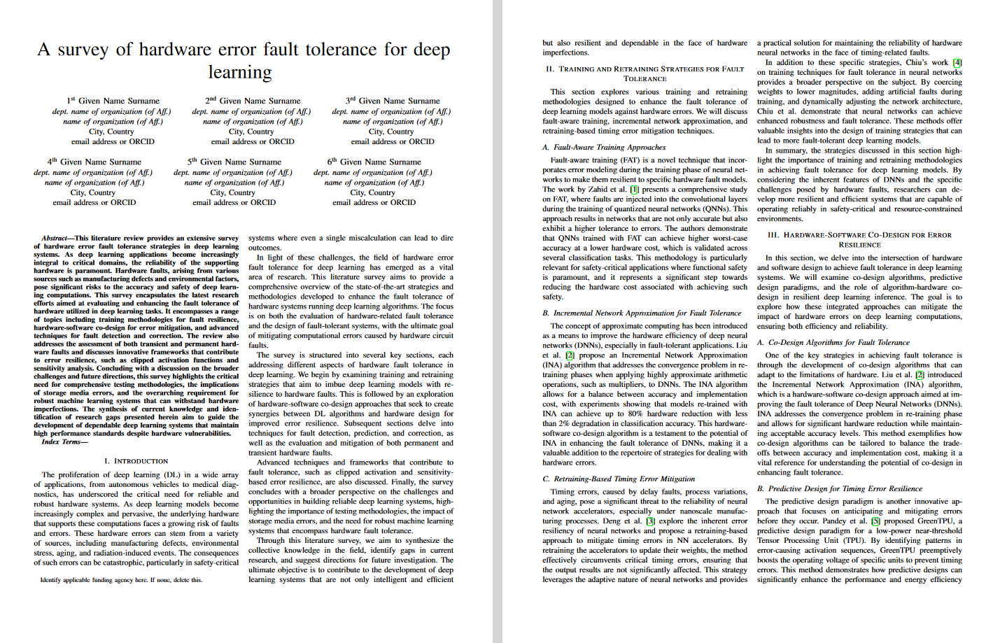
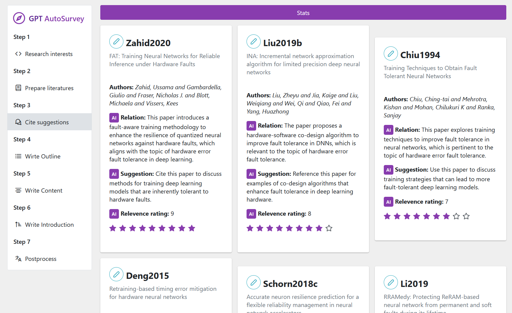

# GPT 生成科研论文综述项目

## 项目概述
本项目是一个利用 GPT 模型自动生成长科研论文综述的工具的实验项目。它通过分析给定的 `.bib` 参考文献文件中的摘要或全文内容(需要pdf)，自动生成论文的各个部分，包括摘要、引言、以及各个主要章节。目前GPT能够生成4~8页的综述文章，已经可作为综述的初步草稿，不过内容质量还有改进空间。

图为生成的效果，完整内容可见pdf。这里除了标题和参考文献信息(不需要人工过滤无关文献)是人工给定外，接下来的参考文献选择、章节安排、完整文章撰写全部都由AI完成。

注：本项目未完成(已中止)。

## 功能模块

- paper_data.py
定义了论文数据的类结构，包括论文标题、摘要、引言部分和主要章节等。`PaperData` 类用于创建和管理论文数据，`MainSection` 类表示论文中的一个主要章节。

- main.py
是项目的主要执行文件，负责整体流程的控制。它使用 `langchain` 库与 GPT 模型进行交互，调用其他模块的功能来生成论文的各个部分。

- parse.py
提供了一个函数 `parsepdf`，用于解析 PDF 文件并提取文本内容。

- main_sections.py
包含生成论文主要章节内容的逻辑。它使用 GPT 模型根据提供的参考文献和章节标题生成章节内容。

- preread_abstract.py
负责预读 `.bib` 文件中的摘要，使用 GPT 模型评估每篇文献与论文主题的相关性，并提供引用建议。

- write_frame.py
用于生成论文的框架，即确定主要章节的标题和开始段落，并根据参考文献的引用建议进行章节划分。

- utils.py
提供了一些辅助功能，如 `dump` 和 `read_dump`，用于日志记录和读取。

## 使用方法
目前各阶段操作需要手动编辑main.py，以避免重复运行其中的一些阶段。需要配置key、GPT模型名称、目标综述标题、选择运行主函数的一些步骤。

1. 准备 `.bib` 参考文献文件，**需要包含摘要部分**。
2. 手动修改`main.py`里的配置。
3. 运行 `main.py` 进行生成。
4. 项目将自动生成论文的各个部分，并最终整合成一篇完整的论文，可直接贴到latex里编译。

## 其他注意事项
- 确保安装了所有依赖库，比如 `langchain` 和 `PyPDF2`。langchain使用的是24年初的较早期版本。
- 根据需要配置 GPT 模型的 API 密钥和代理。
- 项目中的日志记录功能会生成日志文件，存储在 `log/` 目录下。

## 规划

长期规划是制作一个完整的网页APP，它包含对论文综述编写的工作流各个步骤的人工可控生成。这可以避免避免端到端生成的不透明性，例如对生成的特定内容不满意时无法控制或需要全部重新生成。其中对用户可见的中间结果，例如自动生成的章节规划，也可作为良好的科研思路启发，而不必阅读完整的文献综述。

目前规划的7个主要阶段如下：

1. Research interests。起始步骤。用户输入目标研究领域说明、目标综述标题等初步配置信息。
2. Prepare literatures。搜集文献步骤，计划加入API自动搜索下载文献，得到bib文件。
3. Cite suggestions。文献阅读步骤，由AI或人工对收集的文献评分并生成引用建议。
4. Write outline。生成综述大纲。根据收集的文献划分综述章节，得到各个章节的标题、章节引言、引用哪些文献。
5. Write content。生成综述正文。对每个章节编写论文内容。
6. Write introduction。根据综述正文，生成综述的第一章Introduction、摘要、结论等总结性内容。
7. Postprocess。后处理步骤，包括AI精修润色、翻译等功能。

## 可视化网页端(未完成)

对上述步骤增加实验性的可视化网页端。目前完成了规划中两个阶段的只读可视化。运行：
1. 安装node.js。然后用npm安装vue.js。
2. pip安装python flask库。
3. 在项目根目录下运行`python webengine.py`运行数据后端。
4. 在项目fore_end目录下运行`npm run dev`运行前端。
5. 打开前端网页`http://localhost:5173`。

后端：一个简单的读数据flask服务器，读取产生的json文件。(计划改为可通过网页端读写编辑)

### 前端

前端使用了vue框架。App.vue是整个页面框架，包含导航栏部分。各阶段的分页面和页面组件定义在components下面。

